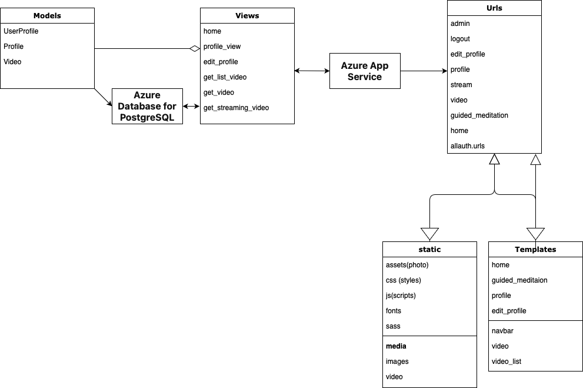

## Online-Meditation-and-Mindfulness-Community
The website can be found at

https://calm-connections.azurewebsites.net

## Author
Dmytro Bilyk

dmbilyk3861@gmail.com

https://t.me/@lkjhg13

# Project Documentation

## Architecture

The website is developed using Python version 3.11 and is built upon the Django framework version 5.0.3

### List of Applications

- Challenge
- Feedback
- Forum
- Progress
- WEB

### The main program files are located in the WEB directory

### Static files such as photos, javascript scripts, and css styles are located in the static directory

### Other image files are located in the media directory

### HTML files are located in the templates directory

#### Additionally

JavaScript, CSS, and HTML are employed to enhance the frontend functionality and presentation.
-The code was restructured and refactored to make the code cleaner

## Usage
To get all the features of the service, you need to have a Google account for simple authorization, one step 
and you will have access to everything our service offers.And every week there will be more and more opportunities.

### Can use locallhost
```bash
pip install requirements.txt
```

```bash
python manage.py migrate
```

```bash
python manage.py runserver 8000
```
And go to:

http://127.0.0.1:8000/

## Application Features

• User Registration: Users can create accounts using their Google credentials, ensuring a seamless onboarding
experience.

• Profile Customization: Personalize your profile with information and preferences to tailor your meditation experience.

• Guided Meditation Sessions:Access a library of guided meditation sessions led by experienced instructors, catering to
various needs and skill levels.So that each user can choose the meditation they want.

• Community Forum:Engage with like-minded individuals, share experiences, and support one another on the path to
mindfulness.

• Progress Tracking:Monitor your meditation progress, set goals, and track achievements to stay motivated.

• Weekly Challenges: Participate in themed challenges designed to deepen your mindfulness practice and encourage
consistency.

• Resource Library:Explore articles, videos, and other resources covering topics such as mindfulness techniques, stress
management, and holistic wellness.-Coming soon.

• Event Calendar:Stay up-to-date on upcoming meditation sessions, workshops, and community events to plan your

• Coming soon.

## Project Task Decomposition

### Week 1:

- Implement feature: User Registration with Google OAuth 2.0 ✔️
- Set up Azure environment for project deployment ✔️
- Initialize GitHub repository for version control ✔️
- Create README.md file with Getting Started documentation ✔️
- Set up Continuous Integration/Continuous Delivery pipeline ✔️

### Week 2:
- Implement feature: Profile Customization ✔️
- Design architecture diagram for the project ✔️
- Configure CI/CD pipeline for automated deployment on Azure ✔️
- Begin writing unit tests for user registration functionality ✔️
- Document project architecture in README.md ✔️

### Week 3:

- Develop infrastructure diagram outlining Azure components ✔️
- Enhance unit test coverage for user registration ✔️
- Create Postman collection for testing user registration endpoints ✔️
- Implement feature: Guided Meditation Sessions ✔️
- Update README.md with project tasks decomposition ✔️


### Week 4:

- Expand unit tests to cover profile customization functionality ✔️

- Implement feature: Community ✔️

- Integrate feedback system for user interaction ✔️

- Conduct testing on Google Chrome PC browsers for compatibility ✔️

- Review and update documentation in README.md ✔️

### Week 5:

- Optimize Azure deployment for performance and scalability ✔️


- Conduct user acceptance testing to ensure seamless functionality ✔️

- Refactor code for improved readability and maintainability ✔️

- Update README.md with testing procedures and results ✔️

- Implement feature: Progress Tracking ✔️

### Week 6:

- Conduct load testing to assess platform performance under stress ✔️
- Implement feature: Weekly Challenges ✔️
- Review and update unit tests for new features and functionality ✔️
- Enhance user interface for intuitive navigation and engagement ✔️
- Document load testing results and optimizations in README.md ✔️

### Week 7:

- Implement feature: Resource Library

- Conduct security audit and implement necessary measures ✔️

- Enhance error handling and logging for improved troubleshooting ✔️

- Integrate event calendar functionality with live session scheduling ✔️

- Update README.md with security measures and best practices ✔️

### Week 8:

- Implement feature: Event Calendar ✔️

- Conduct code review and address any identified issues or vulnerabilities ✔️

- Perform accessibility testing to ensure inclusivity ✔️

- Implement social sharing functionality for user engagement ✔️

- Document accessibility features and testing results in README.md ✔️

## Test results and what was tested

- Main application, home page, stress test of home page with locust

- Chrome Compatibility testing

- Testing the forum for creating posts and replies

- Testing weekly challenges: joining and completing

- Testing feedback forms

- Testing Progress creating a runtime task and deleting it

- Testing the profile page for saving and displaying information

- Testing the meditation page for displaying videos

- Testing the event calendar for creating and deleting events

- Testing the resource library for creating and deleting resources

- Testing the user registration page

### Where identified issues or vulnerabilities

- Week Challenges: The user can join the challenge multiple times, which is not correct

- Week Challenges: Not work success button and not show the user's progress

### Inclusive Test

- The website is accessible to all users, including those with disabilities.

- Tab navigation is enabled for users who rely on keyboard navigation.

- Blue color is used to highlight active links and buttons.

- Daltonism is taken into account when choosing colors.

- Accessibility features are implemented to ensure a seamless user experience for all users.

- No flashing or blinking content is present to avoid triggering seizures.

### Security

- Protection against CSRF attacks

- Protection against SQL injection

- Created a decorator that is used for each page custom_login_required

- All secret keys are stored either in the database or in .env

- The pages are protected from attacks and interference with the site.

- It is impossible for unauthorized users to access certain pages

### User Acceptance Testing

- The "User Profile" section does not display BIO after saving.✔️

- No option to add a profile photo.-

- The site footer needs to correct "freeback" instead of "freeback".✔️

- Forum have no option to reply to a user and create your own wall on a question you interested in.✔️

- No "back" button when leaving a page with meditation video from youtube.✔️

- The section with tasks is useless if it is not logically connected to the parts of the site, which would be a task.✔️

- Cute loading wheel✔️

# Project scheme


